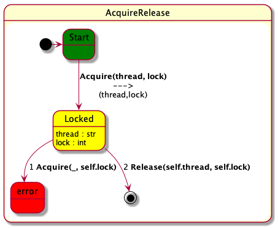
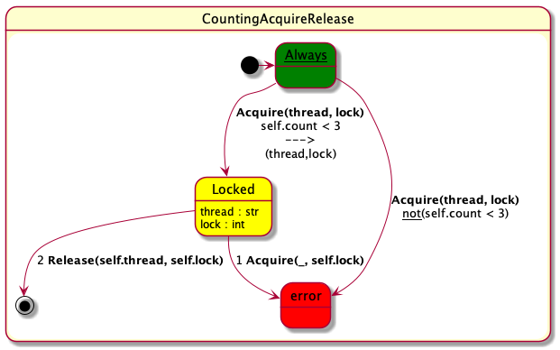
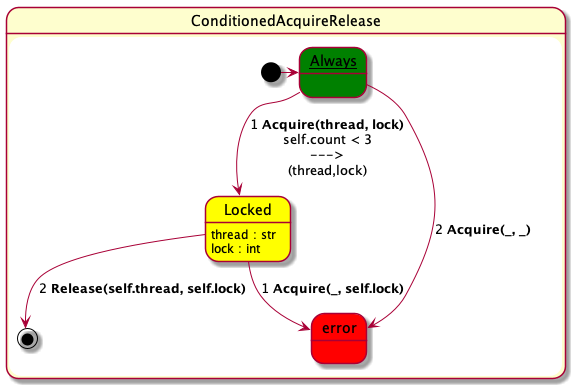
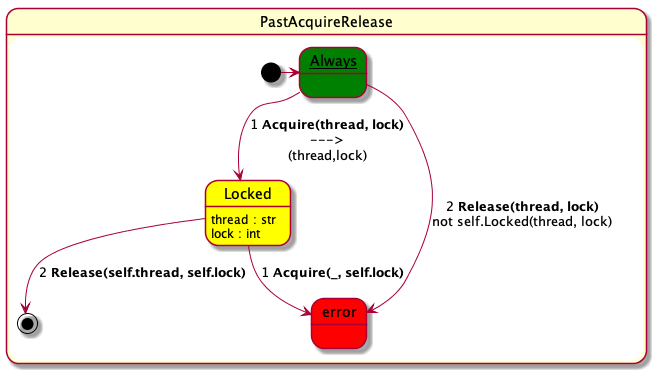
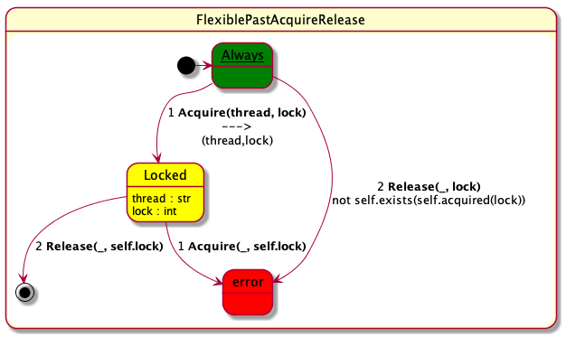
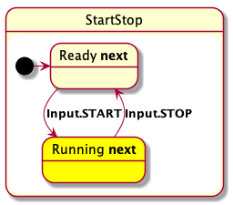
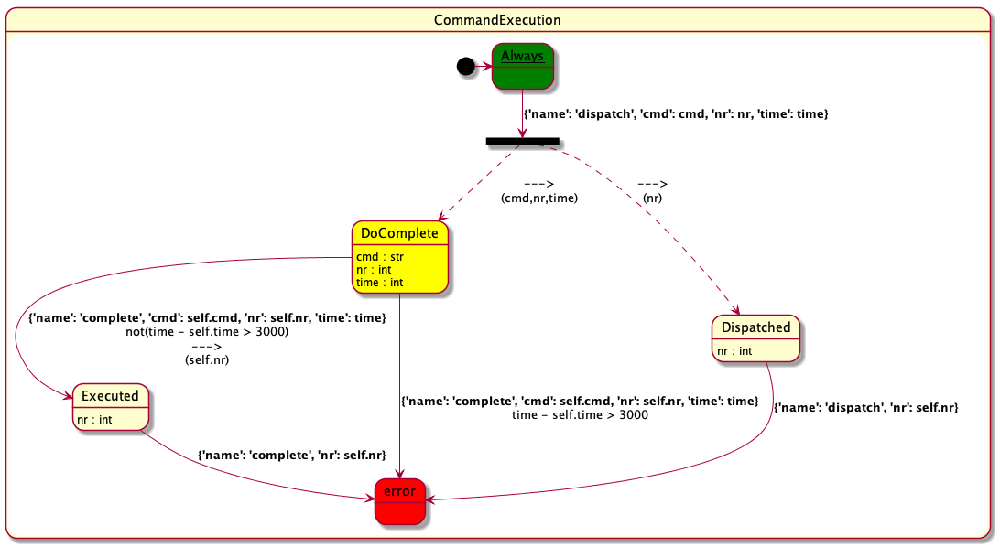
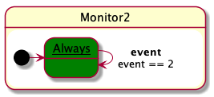
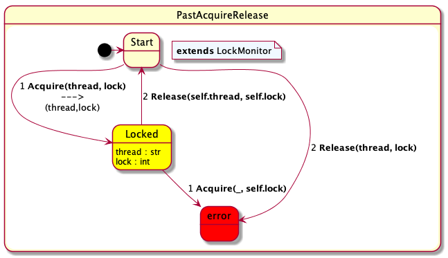
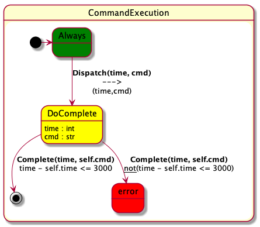

# PyContract

Version 1.2

PyContract is an internal Python DSL for writing event stream monitors. It is based on state machines but extends them in two fundamental ways. First, in addition to control states the user can also define variables, updated and queried on transitions (what is also called extended finite state machines). Second, states can be parameterized with data. The underlying concept is that at any point during monitoring there is a set of _active states_, also referred to as the _"state vector"_. States can be added to this set by taking state to state transitions (target states are added), and can be removed from this vector by leaving states as a result of transitions. Each state in the vector can itself monitor the incoming event stream. The user can mix state machines with regular Python code as desired. 

The general idea is to create a monitor as a class sub-classing the `Monitor` class, create an instance of it, and then feed it with events with the `eval(event: Event)` method, one by one, and in the case of a finite sequence of observations, finally calling the `end()` method on it. If `end()` is called, it will be determined whether there are any outstanding obligations that have not been satisfied (expected events that did not occur).

This can schematically be illustrated as follows:

```python
from pycontract import *

# defining the monitor:

class MyMonitor(Monitor):
    # your specification
    ...

# using the monitor:

m = MyMonitor()
m.eval(event1)
m.eval(event2)
...
m.eval(eventN)
m.end()
```

In the following, we shall illustrate the API by going through a collection of examples. All examples can be found in the `test/readme-file` folder.
 
## Installation 

- Python 3.10 or later: PyContract uses [pattern matching](https://peps.python.org/pep-0636/) that was introduced in Python 3.10. You will therefore need to install Python 3.10 or later.
- do a `git clone https://github.com/pyrv/pycontract.git` in a directory `DIR`of choice (or download the zip file and unzip). This will create a directory `pycontract` in `DIR`.
- Set your PYTHONPATH variable to point to pycontract as e.g.:
```
export PYTHONPATH=$PYTHONPATH:$DIR/pycontract
```

- Some Python packages may need to be installed on your machine, e.g.:

```
python -m pip install "pyfiglet"
python -m pip install "pandas"
python -m pip install "xlrd"
```

## Test Installation

```
cd $DIR/pycontract/demo
python demo_using_dictionaries.py
```

This should yield the following output:

```
*** error transition in Commands:
    state DoComplete(1000, 'TURN', '1')
    event 5 {'op': 'COMPLETE', 'time': 5000, 'cmd': 'TURN', 'nr': '1'}
    TURN 1 completion takes too long
*** error transition in Commands:
    state DoComplete(7000, 'SEND', '4')
    event 8 {'op': 'DISPATCH', 'time': 8000, 'cmd': 'SEND', 'nr': '4'}
    SEND 4 dispatched more than once
*** error transition in Commands:
    state Completed('THRUST', '3')
    event 9 {'op': 'COMPLETE', 'time': 9000, 'cmd': 'THRUST', 'nr': '3'}
    THRUST already completed

Terminating monitoring!

++++++++++++++++++++++++++++
Terminating monitor Commands
++++++++++++++++++++++++++++

*** error at end in Commands:
    terminates in hot state DoComplete(8000, 'SEND', '4')

================
Analysis result:
================

4 messages!

*** error transition in Commands:
    state DoComplete(1000, 'TURN', '1')
    event 5 {'op': 'COMPLETE', 'time': 5000, 'cmd': 'TURN', 'nr': '1'}
    TURN 1 completion takes too long

*** error transition in Commands:
    state DoComplete(7000, 'SEND', '4')
    event 8 {'op': 'DISPATCH', 'time': 8000, 'cmd': 'SEND', 'nr': '4'}
    SEND 4 dispatched more than once

*** error transition in Commands:
    state Completed('THRUST', '3')
    event 9 {'op': 'COMPLETE', 'time': 9000, 'cmd': 'THRUST', 'nr': '3'}
    THRUST already completed

*** error at end in Commands:
    terminates in hot state DoComplete(8000, 'SEND', '4')
```

## Basic Example

We shall now illustrate a complete runnable example. 

Consider the monitoring of acquisition and release of locks by threads. We shall monitor a sequence of events, where each event indicates either the acquisition of a lock by a thread, or the release of a lock by a thread. We can then formulate various policies about such acquisitions and releases as monitors.

### Importing PyContract

First we need to import PyContract:

```python
from pycontract import *
```

### Events

Let us then define the type of events:

```python
@data
class Acquire(Event):
    thread: str
    lock: int

@data
class Release(Event):
    thread: str
    lock: int
```

Each event type is parameterized with a thread (a string) and lock (an integer). That is, Acquire and Release events can be created as follows:

```python
Acquire("wheel", 12)
Release("wheel", 12)
```

Each event class is decorated with the decorator `@data`. This allows us to define the parameters `thread` and `lock` as fields as shown (instead of defining a `__init__(self, thread, lock)` method, which is more verbose. It also allows us later to perform pattern matching on such events.

### The property

We can then formulate our first property: 

- _"A thread acquiring a lock should eventually release it. Furthermore, a lock can be acquired only once before being released again"_. 

### The monitor

This property is stated as the following monitor:

```python
class AcquireRelease(Monitor):
    @initial
    class Start(AlwaysState):
        def transition(self, event):
            match event:
                case Acquire(thread, lock):
                    return self.Locked(thread, lock)

    @data
    class Locked(HotState):
        thread: str
        lock: int

        def transition(self, event):
            match event:
                case Acquire(_, self.lock):
                    return error('lock re-acquired')
                case Release(self.thread, self.lock):
                    return ok
```

The monitor is formulated as a class `AcquireRelease` extending the `Monitor` class. The body of the `AcquireRelease` monitor class defines two states named respectively: `Start` and `Locked`. 

### The Start state

The `Start` state is the initial state, indicated with the `@initial` decorator. It subclasses the `AlwaysState`, which indicates that it is always present, even after transitions out of it are taken. The body of the `Start` state is the definition of the `transition` function, which takes an event as argument and returns a state or a list of states. Note that the result of a transition can be more than one state. If a state does not have any outgoing transitions, it can be omitted. There are situations where this makes sense.

The body of the `transition` function is defined using Python 3.10's pattern matching, It consists of a `match` statement, branching out on the structure of the event. In  this case, an `Acquire(thread, lock)` event causes the creation of a `Locked(thread, lock)` state.

Note that in case of an event that does not match any of the `case` entries, this is considered as the event not matching any transition. How this is treated depends on the kind of state. However, for most kinds of states, it just means that the event is skipped and the state stays active. 

### A note

Note the expression: `self.Locked(thread, lock)`. It denotes an instance of the class `Locked` defined in the `AcquireRelease` class. This works due to an admitted "hack": `self` here refers to the `Start` state but the `Locked` class is defined in the `AcquireRelease` monitor class. It works because fields that are looked up in a state get looked up in the monitor in case they are not found in the state. A more correct way to refer to this class would be as
`self.monitor.Locked(thread, lock)` (since every state has a `monitor` variable pointing to the enclosing monitor) or `AcquireRelease.Locked(thread, lock)`. However, these references are more verbose. This "hack" may be replaced by a cleaner solution.


### The Locked state

The `Locked` state, in turn, is a `HotState`. This means that at the end of monitoring an error is reported if such a state is active. This state is parameterized with a thread and a lock. Again, we use the `@data` decorator to indicate this (this decorator also introduces a hash-function needed to store states in a set and defining equality on states based on their data arguments, as case classes in Scala).

The `transition` function for this state cases out on whether it is an `Acquire` event or a `Release` event. The pattern `Acquire(_, self.lock)` matches any `Acquire` event where the second argument, the lock, is the same as `self.lock`. The first argument, the thread, we don't care about, indicated by an underscore. In this case an error (state) is returned, with an optional error message.

In the second case, the `Release(self.thread, self.lock)` matches a `Release` event only if the thread argument is equal to `self.thread` and if the lock argument is equal to `self.lock`. In this case the `ok` state is returned, indicating that we are done monitoring the `Locked` state, which then will be removed from the state vector. In general, any dotted name in a pattern indicates that the incoming value has to match this exact value.
                    

### Applying the Monitor

We can now apply the monitor, as for example in the following main program:

```python
m = AcquireRelease()
m.eval(Acquire("arm", 10))
m.eval(Acquire("wheel", 12))
m.eval(Acquire("arm", 12))
m.eval(Release("arm", 12))
m.eval(Release("wheel", 12))
m.end()
```

Note the call `m.end()` which terminates monitoring. A monitor does not need to be terminated by this call, and
will not be if for example it concerns an ongoing online monitoring of an executing system. However, if this method is called, it will check that no monitor is in a _hot_ state, as shown above. This is in effect how eventuallity properties are checked on finite traces.

The result of this particular run is the reporting of two errors, the first because the `arm` thread acquires lock 12 after the `wheel` thread has acquired it. The second because at the end of the trace (when `end()` is called), the `arm` thread has not released lock 10. The output from this run is as follows and should be self-explanatory.  At the end the analysis result is printed showing the number of errors and what they are.

```
Initial states of AcquireRelease:
Start()

*** error transition in AcquireRelease:
    state Locked('wheel', 12)
    event 3 Acquire(thread='arm', lock=12)
    lock re-acquired

Terminating monitoring!

++++++++++++++++++++++++++++++++++
Terminating monitor AcquireRelease
++++++++++++++++++++++++++++++++++

*** error at end in AcquireRelease:
    terminates in hot state Locked('arm', 10)

================
Analysis result:
================

2 errors detected!

*** error transition in AcquireRelease:
    state Locked('wheel', 12)
    event 3 Acquire(thread='arm', lock=12)
    lock re-acquired

*** error at end in AcquireRelease:
    terminates in hot state Locked('arm', 10)
```

### Visualization

The monitor can be visualized. By executing:

```python
visualize(__file__)
```

in the file containing the monitor, each monitor in the file will be visualized using [PlantUML](https://plantuml.com). Note that `__file__` denotes the current file. Each monitor is analyzed and from it is generated a text file in PlantUML format, which then is visualized as a `.png` file using PlantUML's image generator. The name of the generated `png` file is composed of the name of the Python file followed by the name of the monitor. For the monitor above the following state machine is generated:

<br>
<p align="center">
  
</p>
<br>

The initial `Start` state is green, denoting that it is an `AlwaysState`. The state `Locked` is bright yellow, denoting the fact that it is a `HotState`. The `error` state is red, and the `ok` state is a black dot inside a grey circle.
The `Locked` state is parameterized with `thread` and `lock`. In the `Start` state, upon an event matching the pattern `Acquire(thread,lock)`, a `Locked` state is generated, with arguments `(thread,lock)`. The arguments are shown below the horisontal `--->` arrow on the transition from `Start` to `Locked`. Note how the transitions from the `Locked` state are numbered. This is important in some cases where the top down evaluation of case entries in a match statement has importance (although it has no importance here).
Transitions are, however, only numbered if there are more than one case entry.

If we instead execute the statement:

```python
visualize(__file__, True)
```

The generated text file that is input to PlantUML, and from which the `.png` file is generated, is stored with file suffix `.pu`. 
In this case it looks as follows.

```
@startuml
state AcquireRelease{
  [*] -> Start
  state Start #green
  state Locked #yellow : thread : str\nlock : int
  Start --> Locked : **Acquire(thread, lock)**\n--->\n(thread,lock)
  state error #red
  Locked --> error : 1 **Acquire(_, self.lock)**
  Locked --> [*] : 2 **Release(self.thread, self.lock)**
}
@enduml
```

## Debugging

We can run the above program in debugging mode. This is done by setting the debug flag to True by a call to the `set_debug(flag: bool)' function:

```python
m = AcquireRelease()
set_debug(True) # setting debug flag to True
m.eval(Acquire("arm", 10))
m.eval(Acquire("wheel", 12))
m.eval(Acquire("arm", 12))
m.eval(Release("arm", 12))
m.eval(Release("wheel", 12))
```

Now running our program yields the output below. The output shows for each submitted event the event number and the event, followed by (for each monitor):

- which active states cause which new states to be generated. Note that this may include 
  the original state if no transitions were taken.
- the active states (the state vector) of this monitor after processing the event.

Error messages are issued as we go along.

```
Initial states of AcquireRelease:
Start()

======================================
Event 1 Acquire(thread='arm', lock=10)
======================================

######################
Monitor AcquireRelease
######################

Start() results in [Locked('arm', 10),  Start()]

----------------------
AcquireRelease states:
Start()
Locked('arm', 10)
----------------------

========================================
Event 2 Acquire(thread='wheel', lock=12)
========================================

######################
Monitor AcquireRelease
######################

Start() results in [Locked('wheel', 12),  Start()]
Locked('arm', 10) results in [Locked('arm', 10)]

----------------------
AcquireRelease states:
Locked('arm', 10)
Start()
Locked('wheel', 12)
----------------------

======================================
Event 3 Acquire(thread='arm', lock=12)
======================================

######################
Monitor AcquireRelease
######################

Locked('arm', 10) results in [Locked('arm', 10)]
Start() results in [Locked('arm', 12),  Start()]
Locked('wheel', 12) results in [ErrorState(lock re-acquired)]
*** error transition in AcquireRelease:
    state Locked('wheel', 12)
    event 3 Acquire(thread='arm', lock=12)
    lock re-acquired

----------------------
AcquireRelease states:
Locked('arm', 12)
Start()
Locked('arm', 10)
----------------------

======================================
Event 4 Release(thread='arm', lock=12)
======================================

######################
Monitor AcquireRelease
######################

Locked('arm', 12) results in [OkValue()]
Start() results in [Start()]
Locked('arm', 10) results in [Locked('arm', 10)]

----------------------
AcquireRelease states:
Start()
Locked('arm', 10)
----------------------

========================================
Event 5 Release(thread='wheel', lock=12)
========================================

######################
Monitor AcquireRelease
######################

Start() results in [Start()]
Locked('arm', 10) results in [Locked('arm', 10)]

----------------------
AcquireRelease states:
Start()
Locked('arm', 10)
----------------------


Terminating monitoring!

++++++++++++++++++++++++++++++++++
Terminating monitor AcquireRelease
++++++++++++++++++++++++++++++++++

*** error at end in AcquireRelease:
    terminates in hot state Locked('arm', 10)

================
Analysis result:
================

2 errors detected!

*** error transition in AcquireRelease:
    state Locked('wheel', 12)
    event 3 Acquire(thread='arm', lock=12)
    lock re-acquired

*** error at end in AcquireRelease:
    terminates in hot state Locked('arm', 10)

Process finished with exit code 0

```

## Transition Functions at the Outermost Level

A shorter way of writing the above monitor is to write the transition function of the `AlwaysState` at the top level of the monitor as in the following monitor.

```python
class ShortAcquireRelease(Monitor):
    def transition(self, event):
        match event:
            case Acquire(thread, lock):
                return self.Locked(thread, lock)

    @data
    class Locked(HotState):
        thread: str
        lock: int

        def transition(self, event):
            match event:
                case Acquire(_, self.lock):
                    return error('lock re-acquired')
                case Release(self.thread, self.lock):
                    return ok
```

The outermost transition function is behind the scenes inserted in an `AlwaysState` 
decorated with `@initial`. In other words, it has the same meaning as the previous version. This is a convenient style since often specifications have an initial `AlwaysState`, similar to there being a box-operator in front of temporal logic formulas as in the following classic response-formula (whenever p occurs then eventually q occurs):

\\[
    \Box (p \Rightarrow \Diamond q)
\\]


### Visualization

The visualization of this monitor is as before, except that the initial state is given the default name 
`Always`.


## Code on transitions

This example illustrates the use of Python code as part of a specification, using the lock acquisition and release scenario again. First we reformulate
the property we want to monitor.

### The Property

- _"A thread acquiring a lock should eventually release it. At most one thread can acquire a lock at a time. At most 3 locks should be acquired at any moment"_.

The last sentence requires us to count lock acquisitions and releases.

### The Monitor

The monitor declares a monitor local integer variable `count`, keeping track of the number
of un-released locks. This variable is updated on transitions and checked in a condition.

```python
class CountingAcquireRelease(Monitor):
    def __init__(self):
        super().__init__()
        self.count: int = 0 # <--- variable initialized

    def transition(self, event):
        match event:
            case Acquire(thread, lock):
                if self.count < 3: # <--- variable tested 
                    self.count += 1 # <--- variable incremented
                    return self.Locked(thread, lock)
                else:
                    return error('more that 3 locks acquired')

    @data
    class Locked(HotState):
        thread: str
        lock: int

        def transition(self, event):
            match event:
                case Acquire(_, self.lock):
                    return error('lock re-acquired')
                case Release(self.thread, self.lock):
                    self.count -= 1 # <-- variable decremented. Variable is looked up in monitor
                    return ok
```

Note that we need call also the init method of the `Monitor` super-class.
The example illustrates how state machines can be combined with programming. 

Note how `self.count` in the `Locked` state results in the `count` defined in the monitor class. It is first looked up in the `Locked` class and not found, then looked up in the monitor class.

### Visualization

The visualization of this state machine is as follows. Note how the transitions now are decorated with conditions. Note in particular how the `Acquire(thread,lock)` pattern leads to two different transitions, one with the condition `self.count < 3` and one with the negation `not(self.count < 3)` of that, corresponding to the `if`-statement in the body of that match case. The visualizer tracks such if-statements and accumulates their conditions, as well as the negation of these.

<br>
<p align="center">
  
</p>
<br>

### Placing conditions on transitions

Note that we could instead place the conditions on the transitions, as part of the patterns, as in the following version of the outermost transition:

```python
def transition(self, event):
  match event:
    case Acquire(thread, lock) if self.row < 3:
      self.row += 1
      return self.DoRelease(thread, lock)
    case Acquire(thread, lock) if self.row >= 3:
      return error('more that 3 locks acquired')
```

Due to the fact that these patterns are matched top down, we could write it as follows with the same meaning:

```python
def transition(self, event):
  match event:
    case Acquire(thread, lock) if self.row < 3:
      self.row += 1
      return self.DoRelease(thread, lock)
    case Acquire(_, _):
      return error('more that 3 locks acquired')
```

This will generate the following state visualization, where now it becomes evident that
the order of transitions from the `Always` state matter, which is resolved by their numbering.

<br>
<p align="center">
  
</p>
<br>

## Testing Existence of States in the State Vector in Conditions

We can query whether a particular state is in the _state vector_, as a condition to taking a transition. This is particularly useful for modeling properties reasoning about the past (the past is stored as states). 


### The Property

Let's go back to our lock acquisition and release scenario, and formulate the following property:

- _"A thread acquiring a lock should eventually release it. At most one thread
can acquire a lock at a time. A thread cannot release a lock it has not acquired."_.

It is the last requirement _"A thread cannot release a lock it has not acquired"_, that is a past time property: if a thread is released, it must have been acquired in the past, and not released since. 

### The Monitor

The monitor can be formulated as follows:

```python
class PastAcquireRelease(Monitor):
    def transition(self, event):
        match event:
            case Acquire(thread, lock):
                return self.Locked(thread, lock)
            case Release(thread, lock) if not self.Locked(thread, lock): # <--- test on state
                return error(f'thread {thread} releases un-acquired lock {lock}')

    @data
    class Locked(HotState):
        thread: str
        lock: int

        def transition(self, event): # same as before
            match event:
                case Acquire(_, self.lock):
                    return error('lock re-acquired')
                case Release(self.thread, self.lock):
                    return ok
```

Now the outermost transition contains the case:

```python
case
Release(thread, lock)
if not self.DoRelease(thread, lock):
  return error(f'thread {thread} releases un-acquired lock {lock}')
```

that tests for the occurrence of a `self.Locked(thread, lock)` state in the _state vector_, and if not present yields an error. What happens here is that `self.Locked(thread, lock)` creates a state, which can be used as a Boolean expression with the value True if and only if the state vector contains a state that is equal to it (same name, and same arguments).

This corresponds to the ability to test for presence of facts in classic rule-based programming known from expert systems and AI.

### Visualization

The visualization of this state machine is as follows. 

<br>
<p align="center">
  
</p>
<br>

## Testing Existence of States Satisfying a Predicate

In the previos example we saw one one can test for the existence of a state exactly equal to some state. In this section we shall illustrate how one can test for the existsence of a state satisfying a predicate, which is a more expressive form of test.

### The Property

Let's first sketch the property we want to monitor.

- _"An acquired lock should eventually be released, possibly by the thread acquiring it but not necessarily. At most one thread can acquire a lock at a time. A thread cannot release a lock that has not been acquired."_.

### The Monitor

The following monitor checks this property. 

```python
class FlexiblePastAcquireRelease(Monitor):
    def acquired(self, lock: object) -> Callable[[State], bool]: # <--- new function
        def predicate(state: State) -> bool: # <--- returning a predicate defined here
            match state:
                case self.Locked(_, lock_) if lock_ == lock:
                    return True
        return predicate # <--- return predicate on states

    def transition(self, event):
        match event:
            case Acquire(thread, lock):
                return self.Locked(thread, lock)
            case Release(_, lock) if not self.exists(self.acquired(lock)): # <--- exists 
                return error(f'thread releases un-acquired lock {lock}')

    @data
    class Locked(HotState):
        thread: str
        lock: int

        def transition(self, event):
            match event:
                case Acquire(_, self.lock):
                    return error('lock re-acquired')
                case Release(_, self.lock): # <--- any thread can release a lock
                    return ok
```

First we define a function `acquired` which as argument takes a lock id `lock`, and returns a predicate on states, returning True for any state of the form `Locked(thread,lock)` for any `thread`.

This predicate is then used in the outermost transition in the following case:

```python
case Release(_, lock) if not self.exists(self.acquired(lock)): # <--- exists 
    return error(f'thread releases un-acquired lock {lock}')
```

The function `exists(`_p_`)` for a state predicate _p_ will return True if there is a state _s_ in the state vector for which _p(s)_ is True.

Note also how we in the `Locked` state allow any thread to release a lock by not caring about the thread argument using an underscore.

### Visualization

The visualization of this state machine is as follows.

<br>
<p align="center">
  
</p>
<br>

## Kinds of States

We have above seen two kinds of states: `AlwaysState` and `HotState`. PyContract offers beyond these two states three others: `State`, `NextState`, and `HotNextState`, as explaned in the following table (left column). A user-defined state class must extend one of these, at which point state objects of the userdefined class behave as expained in columns 2-4.


| State Kind    | if no transition | if transition | at end |
| ------------- | ---------------- | ------------- | ------ |
| State         |        stay      |      leave    | ok     |
| HotState      |        stay      |      leave    | error  |
| NextState     |        error     |      leave    | ok     |
| HotNextState  |        error     |      leave    | error  |
| AlwaysState   |        stay      |      stay     | ok     |

A state is characterized by three events: how it behaves when an event does not match any transitions (case patterns), how it behaves if a transition is made (case pattern matches), and how it behaves if remaining in the state vector at the end of monitoring when the `end()` method is called. _stay_ means that the state survives for the next iteration, _leave_ means that the state is removed.


           
## Illustrating NextState and HotNextState

In this example, we shall illustrate a state machine with a looping behavior

### The Events

We are monitoring a sequence of `Start` and `Stop` events, each carrying a task id as parameter:

```python
@data
class Start(Event):
    task: int

@data
class Stop(Event):
    task: int
```

### The Property

The property we want to monitor is the following: 

- _"We should see an alternation of Start(x) and Stop(x) events, where the task id in the Stop(x) event is the same as in the Start(x) event. A legal pattern is for example: Start(1), Stop(1), Start(4),Stop(4), Start(1), Stop(1)"_.

### The Monitor

This following monitor verifies this property, and illustrates the use of `NextState` and `HotNextState`. Note that these states correspond to respectively final states and non-final states in traditional automata theory in a standard textbook, where the only allowed transitions are those explicitly written.

```python
class StartStop(Monitor):
    @initial
    class Ready(NextState):
        def transition(self, event):
            match event:
                case Start(task):
                    return self.Running(task)

    @data
    class Running(HotNextState):
        task: int

        def transition(self, event):
            match event:
                case Stop(self.task):
                    return self.Ready()
```

### The Main Program

The following main program exercises the monitor.

```python
m = StartStop()
trace = [Start(1), Stop(1), Start(2), Stop(2)]
m.verify(trace)
```

This time we call the `verify(trace: List[Event])` method on the monitor. It calls the `eval(event: Event)` method on each event in the trace and calls `end()` after processing all events in the trace.

### Visualization

The visualization of this state machine is as follows.

<br>
<p align="center">
  
</p>
<br>

There are two new symbolisms occurring here. First of all, the fact that the state 
`Ready` is a `NextState` is shown by the bolded **next** occurring after the state name.
The `Ready` state is not hot and it is not an always state, indicated by the dull yellow color. The fact that the state `Running` is a `HotNextState` is shown by the same bolded **next** and the fact that it is bright yellow, indicating that it is hot. 

## Information instead of Errors

We have seen above how how `error(msg: str = "")` is called in `return` statements, as in:

```python
  return error("a bad transition was taken")
```

This is reflected in the output as an error. Sometimes it is desirable to just exit a state with some information that is recored, and printed at the end of the analysis.
This can be done by returning a call of `information(msg: str)`, as in:

```python
  return information(smallDataReport)
```

Furthermore, similar to `report_error(self, msg: str)` there is also a `report_information(self, msg: str)` method. These can be called anywhere (not in `return` statements), and will record an error or some information respectively.

## What if Events and States do Not Carry Data?

Our state machines so far have been focused on events and states that carry data. 
It is possible to work without data as illustrated in the following, corresponding
to traditional automata theory. Consider the example above, but where start and stop events do not carry data.

### The Events

This time, since events do not carry data we shall use an enumerated type to represent events:

```python
class Input(Enum):
    START = 1
    STOP = 2
```

This also illustrates the point that events can be of any data type: class objects as we have seen above, enumerated types as in this example, dictionaries, etc.

### The Property

The property we want to monitor is the following: 

- _"We should see an alternation of START and STOP events. A legal pattern is for example: START, STOP, START, STOP"_.

### The Monitor

This following monitor verifies this property.

```python
class StartStop(Monitor):
    @initial
    class Ready(NextState):
        def transition(self, event):
            match event:
                case Input.START:
                    return self.Running()

    class Running(HotNextState):
        def transition(self, event):
            match event:
                case Input.STOP:
                    return self.Ready()
```

### The Main Program

The following main program exercises the monitor.

```python
m = StartStop()
trace = [
    Input.START, Input.STOP, Input.START, Input.STOP
]
m.verify(trace)
```

Note that in this case the repeated creation (and garbage collection) of `Ready()` and `Running()` states is a bit heavy-handed since there are no data, and could be optimized.

### Visualization

The visualization of this state machine is as follows.

<br>
<p align="center">
  
</p>
<br>

## A More Complex Example

In this more complex example we shall illustrate some features not explained previously, namely:

-  **dictionaries as events** 
-  a transition that returns **more than one state**;
-  the **State** which was one of the five state kinds 
-  specification of **real-time** properties

Our property concerns the dispatch and completion of commands on board a spacecraft. A dispatch is the start of the execution of a command, and completion is the end of the execution. Each command execution in addition has a unique number associated with it.
All events are time stamped.

### The Events

In this case we shall assume that events are dictionaries of the type

```python
Dict[str, object]
```

That is: mappings from strings to any data objects. This illustrates the point that events can be of any data type: class objects as we have seen above, enumerated types as in a previous example, and dictionaries as shown here. Python 3.10's pattern matching works nicely on dictionaries. 

We shall in particular assume event dictionaries conform to the pattern:

```python
{'name': str, 'cmd': str, 'nr': int, 'time': int}

```

Such an event represents an action on board a spacecraft, with a given name (`dispatch` or `complete`), concerning a given command, with a particular number, and at a given time. 

### The Property

The property we want to monitor is the following: 

- _"When a command is dispatched onboard the spacecraft, with a number, then that command must be completed within 3 seconds, after which it cannot be completed again. A command with a particular number can only be dispatched once."_.

### The Monitor

This following monitor verifies this property.

```python
class CommandExecution(Monitor):
    def transition(self, event):
        match event:
            case {'name': 'dispatch', 'cmd': cmd, 'nr': nr, 'time': time}:
                return [
                    self.DoComplete(cmd, nr, time),
                    self.Dispatched(nr)
                    ]

    @data
    class DoComplete(HotState):
        cmd: str
        nr: int
        time: int

        def transition(self, event):
            match event:
                case {'name': 'complete', 'cmd': self.cmd, 'nr': self.nr, 'time': time}:
                    if time - self.time > 3000:
                        return error(f'command execution beyond 3 seconds')
                    else:
                        return self.Executed(self.nr)

    @data
    class Executed(State):
        nr: int

        def transition(self, event):
            match event:
                case {'name': 'complete', 'nr': self.nr}:
                    return error(f'command nr {self.nr} re-executed')

    @data
    class Dispatched(State):
        nr: int

        def transition(self, event):
            match event:
                case {'name': 'dispatch', 'nr': self.nr}:
                    return error(f'command nr {self.nr} continues')
```

### Returning more than one state

The top level transition function shows how the result of a transition is a list of states, one (`DoComplete(cmd, nr, time)`) that will check that a completion occurs, and one (`Dispatched(nr)`) that checks that no more distpatches occur of that command number. 

The dictionary pattern in the transition function in state `DoComplete` illustrates the different kids of sub-patterns possible: `'name'` must match the string `'complete'`, `'cmd'` must match `self.cmd` (the actually value of this variable), same with `'nr'`, and finally `'time'` binds to the incoming time value.

### The State class

Note that the states `Dispatched` and `Executed` subclass `State`. Such a state waits for an event to match.

### Real-Time

The transition function in state `DoComplete` also illustrates how time is modeled. Time is simply just another data value, and we check that the time has not progreessed beyond 3 seconds (3000 milliseconds) when a command is completed.

We can model this in a perhaps simpler manner as in the following transition function, where the first **case** attempts to match on any event with a time that is beyond 3 seconds. 

```python
        def transition(self, event):
            match event:
                case {'time': time} if time - self.time > 3000:
                    return error(f'command execution beyond 3 seconds')
                case {'name': 'complete', 'cmd': self.cmd, 'nr': self.nr, 'time': time}:
                    return self.Executed(self.nr)
```

This version will issue an error as soon as any event occurs that bypasses the 3 seconds, whereas the former version only will fail at the next propery completion of that command and number, or at the end of the trace since it is a `HotState`.

The above described approach to the verification of timing properties is limited in the sense that it cannot detect a timing violation as soon as it occurs. It is purely dependent on time stamps in incoming events.

### The Main Program

The following main program exercises the monitor.

```python
m = SmarterCommandExecution()
trace = [
    {'name': 'dispatch', 'cmd': 'TURN', 'nr': 203, 'time': 1000},
    {'name': 'dispatch', 'cmd': 'THRUST', 'nr': 204, 'time': 4000},
    {'name': 'complete', 'cmd': 'TURN', 'nr': 203, 'time': 5000},
    {'name': 'complete', 'cmd': 'THRUST', 'nr': 204, 'time': 6000},
    {'name': 'complete', 'cmd': 'THRUST', 'nr': 204, 'time': 7500},
]
m.verify(trace)
```

causing the following error messages:

```
*** error transition in CommandExecution:
    state DoComplete('TURN', 203, 1000)
    event 3 {'name': 'complete', 'cmd': 'TURN', 'nr': 203, 'time': 5000}
    command execution beyond 3 seconds

*** error transition in CommandExecution:
    state Executed(204)
    event 5 {'name': 'complete', 'cmd': 'THRUST', 'nr': 204, 'time': 7500}
    command nr 204 re-executed
```

### Visualization

The visualization of this state machine is as follows.

<br>
<p align="center">
  
</p>
<br>

Some new symbolism occurs here. First of all, note how the `State` states `Dispatched`
and `Executed` are colored dull yellow, similar to `NextState`s. The meaning is that the monitor can terminate in such a state without it being an error.

Second, the transition out of the green `Always` state leads to two resulting states:
`DoComplete(cmd, nr, time)` and `Dispatched(nr)`. This is graphically illustrated with a transition, annotated with event pattern (and conditions if present) going to a fat black horisontal line from which dashed arrows lead to each of the resulting states and their arguments after the `--->` arrow.

## Exhaustive Transition Funtions

Writing a property where multiple _follow_-events have to happen after an _initiator_-event can be verbose since one has to create a state for each follow-event. This is due to the fact that when a transition is taken in a state, we usually leave that state. A solution to this problem is _exhaustive_ transition functions. To illustrate this concept, let's define the following property.

### The Property

- _"After a dispatch of a command, should follow, in no particular order, the completion of the command, a logging of the command, and a cleanup."_.

### The Monitor Using Multiple States

Below is a monitor for this property using the features we have presented so far. 

```python
class Obligations1(Monitor):
    def transition(self, event):
        match event:
            case {'name': 'dispatch', 'cmd': cmd}:
                return [
                    self.DoComplete(cmd),
                    self.DoLog(cmd),
                    self.DoClean(cmd)
                    ]

    @data
    class DoComplete(HotState):
        cmd: str

        def transition(self, event):
            match event:
                case {'name': 'complete', 'cmd': self.cmd}:
                    return ok

    @data
    class DoLog(HotState):
        cmd: str

        def transition(self, event):
            match event:
                case {'name': 'log', 'cmd': self.cmd}:
                    return ok

    @data
    class DoClean(HotState):
        cmd: str

        def transition(self, event):
            match event:
                case {'name': 'clean', 'cmd': self.cmd}:
                    return ok
```

As we can see, we need a state for each of the follow-events, namely `DoComplete`, `DoLog`, and `DoClean`. 

An alternative solution only needing one state is the following.

### The Monitor Using a State with an Exhaustive Transition Function

In this solution, the `DoCompleteLogClean` state takes care of all three follow-events: `complete`, `log`, and `clean`. The transition function is decorated with the `@exhaustive` decorator which has the following meaning: any transition returning `done()` must be taken before the state is removed. When taking a transition returning `done()`, we return to the state, until all such transitions have been taken, or until e.g. an `ok` or `error` state is returned (as we shall see later).

```python
class Obligations2(Monitor):
    def transition(self, event):
        match event:
            case {'name': 'dispatch', 'cmd': cmd}:
                return self.DoCompleteLogClean(cmd)

    @data
    class DoCompleteLogClean(HotState):
        cmd: str

        @exhaustive
        def transition(self, event):
            match event:
                case {'name': 'complete', 'cmd': self.cmd}:
                    return done()
                case {'name': 'log', 'cmd': self.cmd}:
                    return done()
                case {'name': 'clean', 'cmd': self.cmd}:
                    return done()
```

If we e.g. observe a dispatch of a `TURN` command, and see a `complete` and a `clean`, but no `log` event, we will get an error message of the form:

```
*** error at end in Obligations2:
    terminates in hot state DoCompleteLogClean('TURN')
    Cases not matched that lead to calls of done() :
      line 64 : case {'name': 'log', 'cmd': self.cmd}
```

### Adding ok and error Transitions to an Exhaustive Transition Function

It is also possible to add e.g. `ok` and `error` states to an exhaustive transition function. For example, we can extend our transition function above to to exit the `DoCompleteLogClean` state when a `cancel` event is observed, and to give an error if a `fail` event is observed. This may look as follows.

```python
    @data
    class DoCompleteLogClean(HotState):
        cmd: str

        @exhaustive
        def transition(self, event):
            match event:
                case {'name': 'complete', 'cmd': self.cmd}:
                    return done()
                case {'name': 'log', 'cmd': self.cmd}:
                    return done()
                case {'name': 'clean', 'cmd': self.cmd}:
                    return done()
                case {'name': 'cancel', 'cmd': self.cmd}:
                    return ok
                case {'name': 'fail', 'cmd': self.cmd}:
                    return error()
```
 
## Monitors that are Not State Machines

In the previous examples all our monitors are state machines of one form or the other. However, it is also possible to write monitors without the use of state machines. The following monitor monitors that the number of completions never is bigger than the number dispatches.

```python
class CommandExecution(Monitor):
    def __init__(self):
        super().__init__()
        self.count: int = 0

    def transition(self, event):
        match event:
            case {'name': 'dispatch'}:
                self.count += 1
            case {'name': 'complete'}:
                self.count -= 1
                if self.count < 0:
                    self.report_error('more completions than dispatches')
```

Note the call of the `report_error` method. This method records an error in a context where we don't necessarily want to return an error state. It can be called in any context.

Note that in Python when no value is returned with a **return** statement, `None` is returned. PyContract interpretes the returned `None` by keeping the relevant state in the state vector. In this case, however, the outermost transition implicitly gets embedded in an `AlwaysState` which stays around anyway.

### Visualization

The visualization of this state machine is as follows.

<br>
<p align="center">
  
</p>
<br>

This state machine looks admittedy a bit odd since it does not show the code that is executed on transitions. That includes the counting and the call to `report_error`. The decision not to include code was based on an objective to keep the size of the diagrams small. However, this decision will be re-evaluated.

## Multiple Monitors

Monitors can be combined into a single monitor. For example, the following is possible, at the same time illustrating again that events can be of any data type. The two monitors verify that no 1's and 2's are observed.

```python
class Monitor1(Monitor):
    def transition(self, event):
        if event == 1:
            self.report_error('event 1 submitted')


class Monitor2(Monitor):
    def transition(self, event):
        if event == 2:
            self.report_error('event 2 submitted')


class Monitors(Monitor):
    def __init__(self):
        super().__init__()
        self.monitor_this(Monitor1(), Monitor2())
```

This allows to build a hierarchy of monitors, which might be useful for grouping.
The followng setup violates the second monitor.

```python
m = Monitors()
trace = [3, 4, 5, 2]
m.verify(trace)
```

### Visualization

The visualization of these state machines is as follows.

<br>
<p align="center">
  
</p>
<p align="center">
  
</p>
<p align="center">
  
</p>
<br>


Again, since code to be executed (except for conditions) is not shown (see previous comment on this), the calls for `report_error` is not shown for the two monitors. The visualization of `Monitors` just shows the sub-monitors it contains.

## Using Indexing to Speed up Monitors

The state vector, as we have explained it so far, is a set of states. When a new event is submitted to the monitor, all the states in the state vector are scanned and evaluated on the event. This can be costly in case there are many events. Indexing is an approach to speed up monitoring by defining a function from events to keys, and using the keys as entries in a hashmap to obtain only those states that are relevent to the particular event.  The larger the number of states in the state vector, the more important indexing becomes for obtaining an efficient monitor. The improvement in speed can be several orders of magnitudes. Let us illustrate the indexing approach with a slight modification of our locking example.

### Events

We shall use the same events as before, except that we add an additional `ReleaseAll` event which releases all locks:

```python
@data
class Acquire(Event):
    thread: str
    lock: int

@data
class Release(Event):
    thread: str
    lock: int

class ReleaseAll(Event):
    pass
```

### The property

Our property now becomes: 

- _"A thread acquiring a lock should eventually release it, or it should eventually be released with ReleaseAll, which releases all locks. At most one thread can acquire a lock at a time"_. 


### The monitor

Note that this property is __lock centric__: we can maintain a set of states for each lock: those states that concern only that lock. This is the idea in indexing. We can use the lock id as key in a mapping from  keys to sets of states. This is done by overriding the `key` method in the `Monitor` class (something the user has to do explicitly). This method has the type:

```scala
def key(self, event: Event) -> Optional[object]
```

This function takes an event as argument and returns an optional index of type `object` (any index can be used). It's default return value is `None`. The function can be overridden as follows for our example (note that it may be a good idea to separate out the definition of `key` from the actual monitor: we achive modularity and potential reuse of the `key` function for other monitors):


```python
class LockMonitor(Monitor):
    def key(self, event) -> Optional[object]:
        match event:
            case Acquire(_, lock):
                return lock
            case Release(_, lock):
                return lock
            case ReleaseAll():
                return None
```

The `key` method here extracts the lock from the event and turns it into the key. This now means that all events concerning a specific lock are fed to only those states concerned with that lock. Note that `ReleaseAll` is mapped to `None`. This has as effect that this event is sent to all states, independent of their key. This is exaxtly what we want: all locks should be released.

One should be careful with the definition of the `key` method (similarly to how one has to be careful when defining the method `hashCode` and `equals` in Java).


The monitor itself now becomes as follows, extending the `LockMonitor` class. It is the same as before, except for extending the `LockMonitor` class and addition of
`ReleaseAll` as a way of releasing all locks.

```python
class AcquireRelease(LockMonitor): # <--- extending LockMonitor
    def transition(self, event):
        match event:
            case Acquire(thread, lock):
                return self.Locked(thread, lock)

    @data
    class Locked(HotState):
        thread: str
        lock: int

        def transition(self, event):
            match event:
                case Acquire(_, self.lock):
                    return error('lock re-acquired')
                case ReleaseAll() | Release(self.thread, self.lock): <--- ReleaseAll
                    return ok
```

The way indexing works is that on the arrival of an event there are two scenarios:

1. the key of the event is `None`. In this case the event is applied to the _main set_ of states and to all the indexed states (if there are any).
2. the key of the event is **not** `None`. In this case there are two sub-cases:
  -  the key has **not** been encountered before. In this case the event is applied to each state in the _main set_. The resulting set of states is then stored in the hash table with the key as index. The _main set_ is not updated.
  -  the key has been encountered before. In this case there is an entry in the hashmap and the event is applied to the states in the corresponding state set.

We can analyze a trace in debugging mode to see how the internal state vector looks like.

```python
m = AcquireRelease()
set_debug(True)
trace = [
    Acquire("arm", 10),
    Acquire("wheel", 12),
    Acquire("radio", 14),
    Acquire("arm", 12),
    ReleaseAll()
]
m.verify(trace)
```

The output of this program is as given below, omitting how individual states react to events, omitting the repeated printing of the monitor name, and omitting the result summary at the end.

As we can see, the state vector now consists of a _main set_ of states and a _hash table_ mapping keys to sets of states. Comments have been added below.

```
Initial states of AcquireRelease:
Always()

======================================
Event 1 Acquire(thread='arm', lock=10)
======================================

----------------------
AcquireRelease states:
Always()
index 10:
  Always()          # <--- the Always state is carried over from the main set
  Locked('arm', 10) # <--- this state now only occurs at index 10
----------------------

========================================
Event 2 Acquire(thread='wheel', lock=12)
========================================

----------------------
AcquireRelease states:
Always()
index 10:
  Always()
  Locked('arm', 10)
index 12:
  Locked('wheel', 12)
  Always()
----------------------

========================================
Event 3 Acquire(thread='radio', lock=14)
========================================

----------------------
AcquireRelease states:
Always()
index 10:
  Always()
  Locked('arm', 10)    # <--- this state now only occurs at index 10
index 12:
  Locked('wheel', 12)  # <--- this state now only occurs at index 12
  Always()
index 14:
  Locked('radio', 14)  # <--- this state now only occurs at index 14
  Always()
----------------------

======================================
Event 4 Acquire(thread='arm', lock=12)
======================================

*** error transition in AcquireRelease:
    state Locked('wheel', 12)
    event 4 Acquire(thread='arm', lock=12)
    lock re-acquired

----------------------
AcquireRelease states:
Always()
index 10:
  Always()
  Locked('arm', 10)
index 12:
  Always()
  Locked('arm', 12)
index 14:
  Locked('radio', 14)
  Always()
----------------------

====================
Event 5 ReleaseAll()
====================

----------------------
AcquireRelease states:
Always()
index 10:
  Always()  # <--- Locked state has been removed
index 12:
  Always()  # <--- Locked state has been removed
index 14:
  Always()  # <--- Locked state has been removed
----------------------
```

### Visualization

The `LockMonitor`, which just defines the `key` method, is visualized as follows, showing the definition of the key method.

<br>
<p align="center">
  
</p>
<br>

The `AcquireRelease` monitor is visualized as follows.

<br>
<p align="center">
  
</p>
<br>

A note (in light blue) indicates that this montior extends (is a subclass of) `LockMonitor`, and therefore inherits its `key` method.


## Using Indexing to Check Past Time Properties

An interesting application of indexing, beyond just optimization, is the formulation of
past time properties, e.g.: _"if some event P happens now then some other event Q should have happened in the past"_. Recall that we previously checked for the presence of a state
in the state vector to express such a property (specifically the fact `Locked(t,l)`), to model the fact that thread `t` has acquired lock `x`. We can instead use the indexing feature that all events concerning e.g. a lock are sent to the same state set, and we can therefore more efficiently require that a release is not allowed for a lock before it has been acquired. Let's see how this looks like.

The property we formulated earlier was the following:

- _"A thread acquiring a lock should eventually release it. At most one thread
can acquire a lock at a time. A thread cannot release a lock it has not acquired."_.

It is the last requirement _"A thread cannot release a lock it has not acquired"_, that is a past time property: if a lock is released, it must have been acquired in the past, and not released since. The monitor for this property, using indexing, can be formulated as follows.

```python
class PastAcquireRelease(LockMonitor):
    @initial
    class Start(State):
        def transition(self, event):
            match event:
                case Acquire(thread, lock):
                    return self.Locked(thread, lock)
                case Release(thread, lock):
                    return error(f'thread {thread} releases un-acquired lock {lock}')

    @data
    class Locked(HotState):
        thread: str
        lock: int

        def transition(self, event):
            match event:
                case Acquire(_, self.lock):
                    return error('lock re-acquired')
                case Release(self.thread, self.lock):
                    return self.Start()
```

First, note the transition:

```scala
case Release(thread, lock):
    return error(f'thread {thread} releases un-acquired 
```

as part of the initial `Start` state, which will trigger an error in case a `Release` event arrives before an `Acquire` event for a lock.

Also note that the initial state is a `State` and not an `AlwaysState`.
If it was an `AlwaysState` it would have been included in the slice and would cause an error upon any `Release` event for the lock of that slice.

This is fundamentally how slicing-based systems such as 
[MOP](http://fsl.cs.illinois.edu/index.php/JavaMOP4) 
model past time properties.

### The main program

Consider the following main program:

```python
m = PastAcquireRelease()
set_debug(True)
trace = [
    Acquire("arm", 10),
    Acquire("wheel", 12),
    Release("arm", 10),
    Release("arm", 14)
]
m.verify(trace)
```

Running this yields the following output.

```
Initial states of PastAcquireRelease:
Start()

======================================
Event 1 Acquire(thread='arm', lock=10)
======================================

##########################
Monitor PastAcquireRelease
##########################

Start() results in [Locked('arm', 10)]

--------------------------
PastAcquireRelease states:
Start()
index 10:
  Locked('arm', 10)
--------------------------

========================================
Event 2 Acquire(thread='wheel', lock=12)
========================================

##########################
Monitor PastAcquireRelease
##########################

Start() results in [Locked('wheel', 12)]

--------------------------
PastAcquireRelease states:
Start()
index 10:
  Locked('arm', 10)
index 12:
  Locked('wheel', 12)
--------------------------

======================================
Event 3 Release(thread='arm', lock=10)
======================================

##########################
Monitor PastAcquireRelease
##########################

Locked('arm', 10) results in [Start()]

--------------------------
PastAcquireRelease states:
Start()
index 10:
  Start()
index 12:
  Locked('wheel', 12)
--------------------------

======================================
Event 4 Release(thread='arm', lock=14)
======================================

##########################
Monitor PastAcquireRelease
##########################

Start() results in [ErrorState(thread arm releases un-acquired lock 14)]
*** error transition in PastAcquireRelease:
    state Start()
    event 4 Release(thread='arm', lock=14)
    thread arm releases un-acquired lock 14

--------------------------
PastAcquireRelease states:
Start()
index 10:
  Start()
index 12:
  Locked('wheel', 12)
--------------------------


Terminating monitoring!

++++++++++++++++++++++++++++++++++++++
Terminating monitor PastAcquireRelease
++++++++++++++++++++++++++++++++++++++

*** error at end in PastAcquireRelease:
    terminates in hot state Locked('wheel', 12)
```

### Visualization

The visualization of this state machine is as follows.

<br>
<p align="center">
  
</p>
<br>

## Getting Events from a CSV file

A common application of PyContract will be log analysis. 
Log files can have any format, one just needs to write a parser, 
that parses a log file and generates events to be monitored. 
PyContract provides built-in support 
for parsing [CSV](https://en.wikipedia.org/wiki/Comma-separated_values) (Comma Separated Value format) 
files.  Each line in a CSV file consists of a list of comma 
separated strings. An example is the following CSV file concerning command 
dispatches and completions (related to a previously shown example). It has a first
header line, naming the columns `OP`, `TIME`, and `CMD`. These can then be used as indexes into
a line, as we shall see.

```
OP,TIME,CMD
CMD_DISPATCH,1000,TURN
CMD_DOWNLOAD,1500,STOP
CMD_DISPATCH,4000,THRUST
CMD_COMPLETE,5000,TURN
ALIEN,ENCOUNTERED
CMD_COMPLETE,6000,THRUST
```

PyContract provides the following class for reading events from such a CSV file:

```python
class CSVSource:
    def __init__(self, file: str): 
        ...
    
    def column_names(self) -> Optional[List[str]]:
        return None
    
    ...
```

An instantiation of the class takes the CSV file name as argument. 
The object returned by instatiating the `CVSSource` class is an iterator 
over events, which e.g. can be iterated over in a **for** loop, as shown below.
The default use of the class is to parse a CSV file with a first header line naming the columns
(as is common in CSV files, and is shown in the above example CSV file). 
If the CSV file does not contain a header, the user should subclass this class
and override the `column_names` to return a list of column names to be used in the
monitor.

### The Property

The property we want to monitor is the following: 

- _"When a command is dispatched onboard the spacecraft, then that command must be completed within 3 seconds."_.

### The Monitor

We shall show all the required code below, illustrating a complete example. 
First we define the events.

```python
from pycontract import *

@data
class Event:
    time: int

@data
class Dispatch(Event):
    cmd: str

@data
class Complete(Event):
    cmd: str
```

A converter function is then defined, which translates lines in the CSV file to events:

```python
def convert(line) -> Event:
    match line["OP"]:
        case "CMD_DISPATCH":
            return Dispatch(time=int(line["TIME"]), cmd=line["CMD"])
        case "CMD_COMPLETE":
            return Complete(time=int(line["TIME"]), cmd=line["CMD"])
```

The monitor itself is defined as follows.

```python
class CommandExecution(Monitor):
    def transition(self, event):
        match event:
            case Dispatch(time, cmd):
                return self.DoComplete(time, cmd)

    @data
    class DoComplete(HotState):
        time: int
        cmd: str

        def transition(self, event):
            match event:
                case Complete(time, self.cmd):
                    if time - self.time <= 3000:
                        return ok
                    else:
                        return error(f'{self.cmd} completion takes too long')
```

In the main program, we combine the above components.

```python
if __name__ == '__main__':
    m = CommandExecution()
    with CSVSource("commands.csv") as csv_reader:
        for event in csv_reader:
            if event is not None:
                m.eval(convert(event))
        m.end()
```

### Visualization

The visualization of this state machine is as follows.

<br>
<p align="center">
  
</p>
<br>

### END OF FILE

## Contributions

PyContract was developed by Klaus Havelund (<klaus.havelund@jpl.nasa.gov>) 
based on ideas implemented in the similar Scala DSL [Daut](https://github.com/havelund/daut).
The project was a result of extended discussions with Sean Kauffman and Dennis Dams.
